<div align="center">
  
  <h1>DNS Worker</h1>
  <p>基于 Cloudflare Workers & D1 的 Protective DNS 解析服务</p>
  <p>保护您的互联网第一跳</p>
  <p align="center">
    <a href="README.md">English </a> | 中文 (简体) | <a href="README_zh-TW.md">中文 (正體)</a>
  </p>

[](LICENSE)
[](https://workers.cloudflare.com/)

</div>

---

## 📖 简介

**DNS Worker** 是一个轻量级、可扩展的隐私保护 DNS 解析系统。它完全运行在 Cloudflare 的边缘网络上，利用 Workers 的极速响应和 D1 数据库的高效存储，为用户提供精细化 DNS (over HTTPS) 控制体验。

[](https://deploy.workers.cloudflare.com/?url=https://github.com/Obein/DNS-Worker)

### 何以 DNS Worker？

| | 传统 DNS 方案 | DNS Worker |
|---|---|---|
| **托管** | 需要 VPS 或家用服务器 | 运行于 Cloudflare 免费层级，免服务器 |
| **延迟** | 取决于服务器位置 | 在全球 300+ 城市边缘计算 |
| **维护** | 手动更新、系统补丁 | 免维护的 Serverless 部署 |
| **扩展** | 受硬件限制 | 随 Cloudflare 网络自动扩展 |
| **成本** | 服务器费用 + 电费 | 个人使用基本免费 |

> 5 分钟内部署您自己的隐私保护 DNS 解析器 —— 免信用卡、免服务器、免运维。

### 什么是 DNS over HTTPS (DoH)？

DoH (RFC 8484) 是一种通过加密的 HTTPS 连接进行 DNS 查询的协议。与传统明文 DNS 相比，DoH 能够：

- **防止劫持**：防止 ISP 或第三方篡改 DNS 响应。
- **增强隐私**：通过加密隧道隐藏您的浏览记录。
- **绕过审查**：在受限网络环境下提供更稳定的解析服务。

---

## ✨ 核心功能

- 🚀 **极速解析**：完全基于边缘计算，全球延迟极低。
- 🗒️ **多配置管理 (Profiles)**：支持创建多个独立配置，每个配置拥有唯一的端点。
- 🛡️ **精细过滤**：
  - **黑/白名单**：支持精确域名及子域名通配符。
  - **第三方规则集**：支持订阅 AdGuard 等格式的外部拦截列表。
  - **自定义重定向**：支持 A/AAAA/TXT/CNAME 记录的自定义覆盖。
- 📊 **实时统计与日志**：可视化仪表盘，记录每一次请求的命中原因、地理位置及上游延迟。
- 🔐 **隐私增强**：支持 ECS (EDNS Client Subnet) 灵活配置（透传、自定义或隐藏）。
- 🔒 **重写 ECH & ECH Fronting**：针对 HTTPS (Type 65) / SVCB (Type 64) 查询，自动重写/注入 ECH (Encrypted Client Hello) 参数与自定义表层伪装域名（Outer SNI / ECH Fronting），全程加密真实目标域名以防中间人窥探与阻断。（*注：重写注入功能仅支持由 Cloudflare 代理的域名*）。
- 🌗 **现代 UI**：支持暗黑模式，基于 React + BlueprintJS 构建的高密度管理面板。

---

## 🖼️ 界面预览

| 用户登录 | 
|:---:|
| 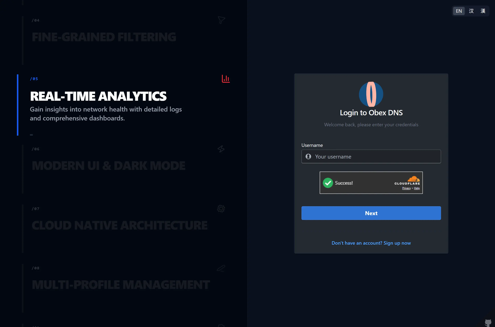 | 

| 安装引导 | 端点配置 |
|:---:|:---:|
| 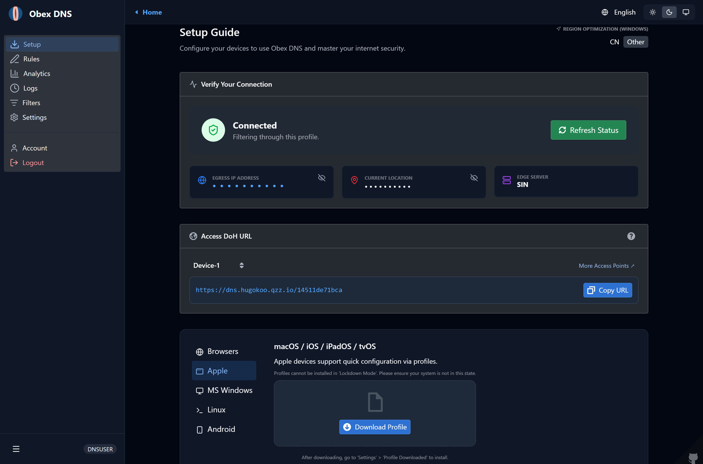 | 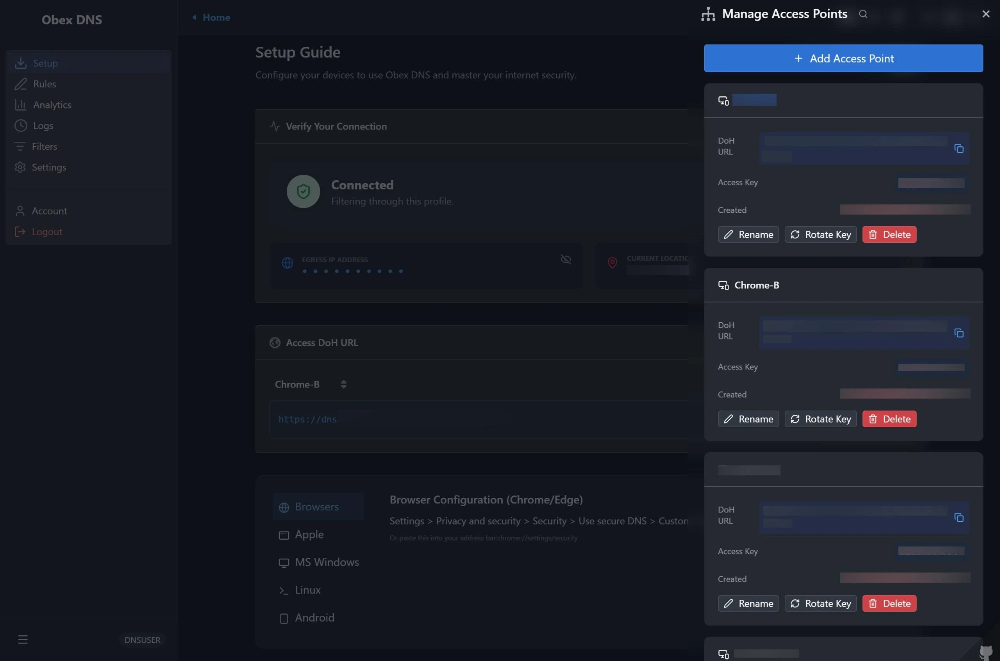 |

| 分析统计 | 解析目的地 |
|:---:|:---:|
| 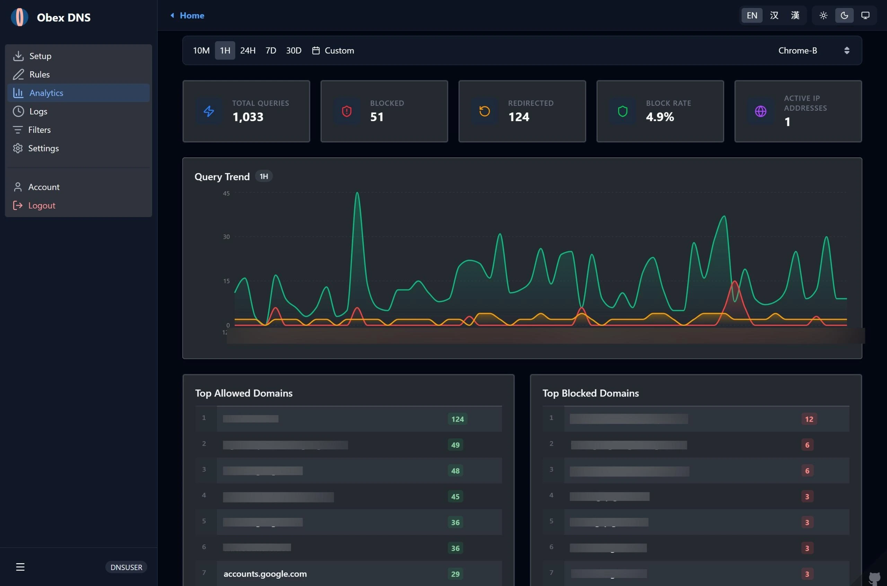 | 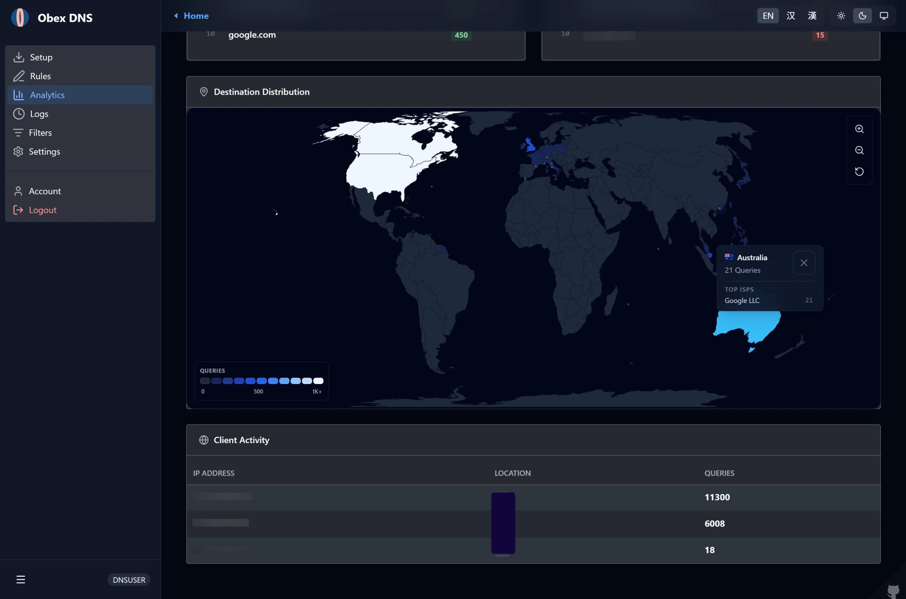 |

| 本地规则管理 | 外部拦截列表 |
|:---:|:---:|
| 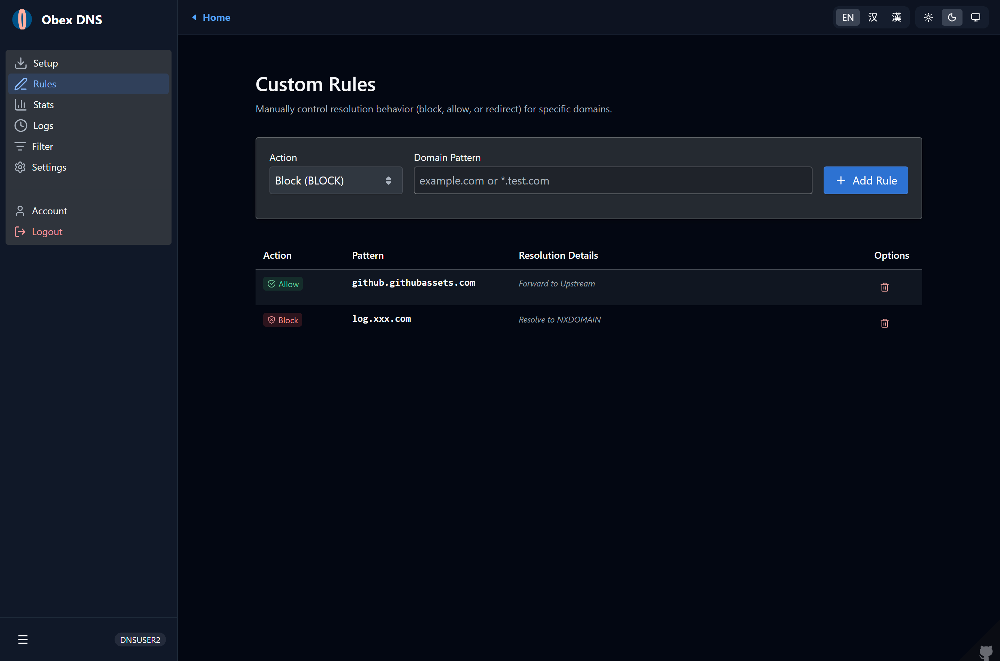 | 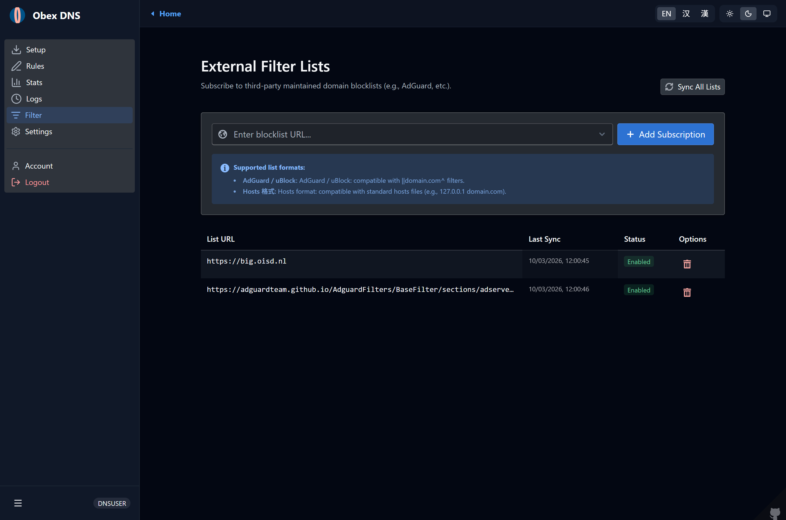 |

| 解析日志 | 日志详情 |
|:---:|:---:|
| 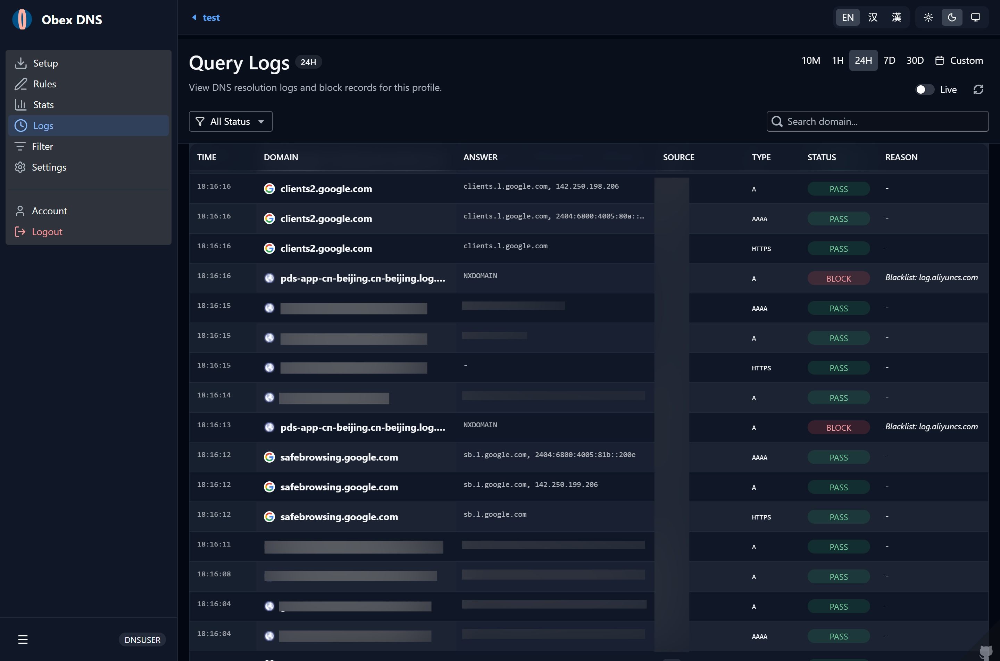 | 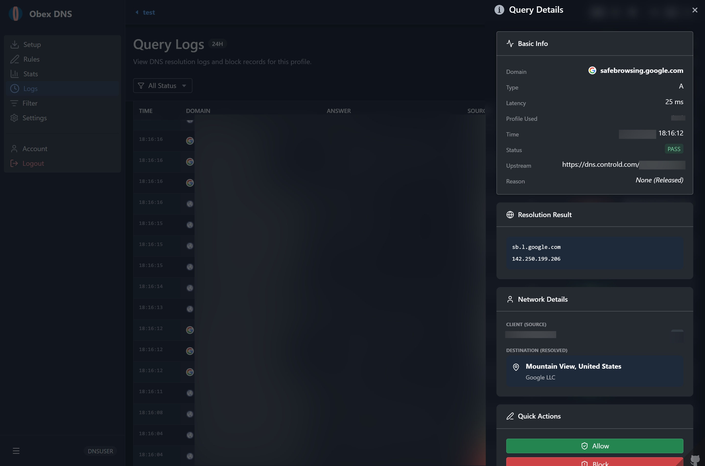 |

| 配置选项 | 配置选择 |
|:---:|:---:|
| 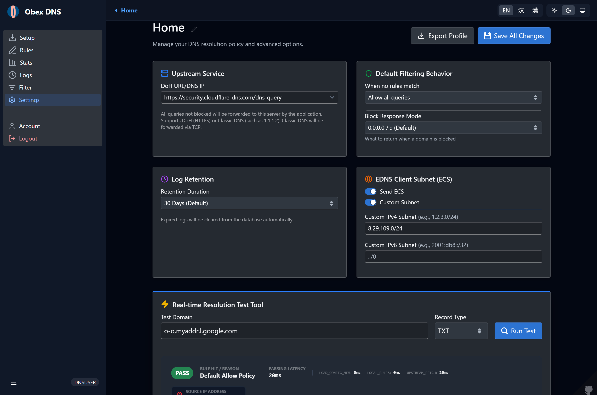 | 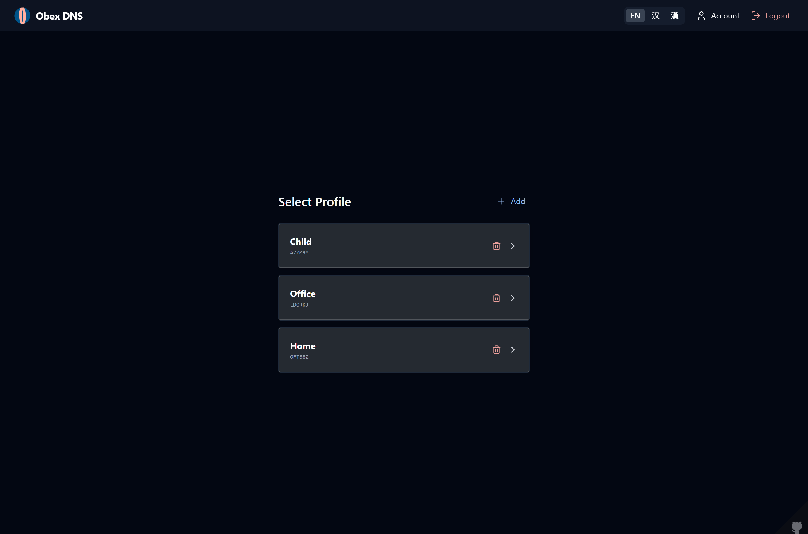 |

| 移动端日志 | 移动端统计 |
|:---:|:---:|
| 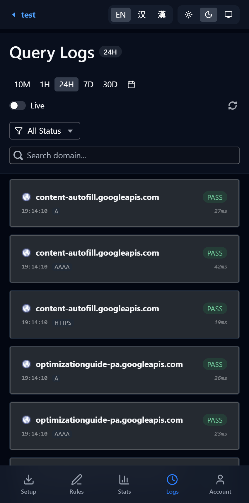 | 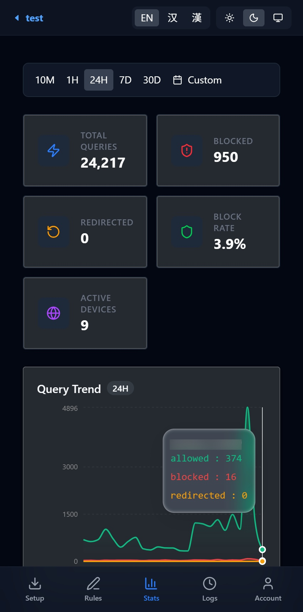 |

---

## 🛠️ 技术架构

### 代码结构

```text
├── src/
│   ├── index.ts          # 入口文件，处理 HTTP 路由与中间件
│   ├── types.ts          # 类型定义
│   ├── api/              # API 控制器 (Auth, Account, Profiles)
│   ├── lib/              # 核心逻辑 (RBAC, 规则过滤)
│   ├── models/           # D1 数据库模型
│   ├── pipeline/         # DNS 解析流水线 (核心业务逻辑)
│   └── utils/            # 工具类 (缓存, GeoIP, DNS 编解码, Bloom 过滤器)
├── web/                  # React/BlueprintJS UI 前端项目
│   ├── public/           # 公共静态文件
│   ├── src/              # 前端源码
│   │   ├── assets/       # 静态资源 (图片、图标等)
│   │   ├── components/   # 可复用的 UI 组件
│   │   ├── i18n/         # 国际化多语言配置
│   │   ├── layouts/      # 布局组件 (仪表板布局等)
│   │   ├── routes/       # 前端路由配置
│   │   ├── services/     # 统一 API 服务封装 (鉴权、账户、配置文件等)
│   │   ├── views/        # 页面 / 视图 (仪表板、日志、设置、引导等)
│   │   └── utils/        # 工具类及辅助函数
│   └── package.json      # 前端依赖配置
├── static/               # 编译后的静态资源
├── migrations/           # D1 数据库迁移脚本
└── wrangler.toml         # Cloudflare 部署配置
```

### 解析流水线 (Resolution Pipeline)

当一个 DNS 请求到达时，它会经过以下处理阶段：

1.  **内存缓存检查**：检查边缘节点内存中是否存在该查询的有效响应。
2.  **配置加载**：从内存 -> Cache API -> D1 数据库分层加载 Profile 设置。
3.  **本地规则匹配**：
    - **白名单**：命中则直接转发上游并返回。
    - **重定向**：命中则返回自定义记录。
    - **黑名单**：命中则返回 NXDOMAIN、0.0.0.0 或自定义结果。
4.  **外部列表过滤**：
    - 利用 **Bloom Filter** (布隆过滤器) 进行快速筛选。
5.  **上游解析**：若以上均未命中，则根据配置请求上游 DoH 服务器，并支持 ECS 处理。
6.  **异步日志与缓存**：异步记录解析日志、获取目标 GeoIP，并将结果写入各级缓存。

---

## 🚀 部署指南

### 线上部署 (Cloudflare Dashboard)

1.  **Fork 本项目**：点击页面右上角的 `Fork` 按钮，将仓库克隆到你的 GitHub 账号下。
2.  **创建 D1 数据库**：登录 Cloudflare 控制台，前往 `Workers & Pages` > `D1`，创建一个新的数据库（例如命名为 `dns_worker_db`），并复制所创建的数据库 ID。
3.  **配置数据库 ID**：在你的 Fork 仓库中，修改 `wrangler.toml` 文件，将 `database_id` 替换为你刚才创建的数据库 ID。
4.  **创建 Worker**：前往 Cloudflare 控制台 `Workers & Pages` > `Create application`。
5.  **从 GitHub 导入并完成首次部署**：在部署页面选择 `Continue with GitHub`，关联你 Fork 的项目并完成授权。在构建与部署设置 (Build & Deploy settings) 中如此填写：
    *   **构建命令**: `npm run build`
    *   **部署命令**: `npm run deploy`
    *   **路径**: `/`
    > ⚠️ **注意**：项目初始化向导中的环境变量仅注入构建容器，运行时的机密变量在初始化向导中填写无效。请直接点击“部署”，待首次部署完成后，按后续步骤在 Worker 设置中填写。
6.  **配置 JWT 密钥**：首次部署完成后，登录 Cloudflare 控制台，前往 `Workers & Pages` > 点击刚才创建的 Worker > `Settings` > `Runtime variables and secrets`（或 `Variables and secrets`） > 点击 `Add`。将变量名称设置为 `JWT_SECRET`，类型选择 `机密 (Secret)`，值中输入一个随机安全字符串，然后点击 `Deploy`（或 `Save and Deploy`）保存。
7.  **配置 KEK 启用信封加密（可选）**：同样在首次部署完成后的 `Settings` > `Runtime variables and secrets` 中，若要对 D1 数据库中的敏感凭据（如 TOTP 密钥和恢复密钥）启用服务端信封加密，请添加一个名为 `KEK_v1`、类型为 `机密 (Secret)` 的变量，并输入您的安全密钥。在需要轮换 KEK 密钥时，请按顺序添加新的机密 `KEK_v(N+1)`（例如 `KEK_v2` -> `KEK_v3` 等）。

### 本地开发与手动部署

#### 开发环境参考

- **Node.js**: v18.x 或更高版本
- **Package Manager**: npm
- **Cloudflare Account**: 需要启用 Workers 和 D1 权限

#### 本地运行与部署步骤

1.  克隆仓库并安装依赖：

```bash
npm install
```

2.  初始化 D1 数据库：

```bash
npm run db:setup
npm run db:migrate:dev
```

3.  配置本地环境变量：
    *   在项目根目录下创建一个 `.dev.vars` 文件，并添加用于会话 Token 签名的 JWT 密钥：
        ```env
        JWT_SECRET=您的随机安全JWT密钥
        ```
    *   （可选）通过添加密钥加密密钥（KEK）启用敏感数据（如 TOTP 密钥和恢复密钥）的服务端信封加密：
        ```env
        KEK_v1=您的随机安全KEK_v1密钥
        ```

4.  启动开发服务器：

```bash
npm run dev
```

5.  手动部署上线：

```bash
npm run deploy
```

### 服务器独立部署 (Serverfull 模式)

DNS Worker 支持脱离 Cloudflare Workers，直接在独立服务器/VPS（Linux、Windows、macOS）上以 Serverfull 模式运行。该模式同时支持：
* **经典 UDP DNS (端口 53)**：标准的 RFC 1035 UDP DNS 解析服务，可直接填入路由器或系统 DNS 设置中。
* **DNS over TLS / DoT (端口 853)**：标准的 RFC 7858 加密 DNS，原生支持 Android 9+ 系统自带的“私有 DNS”（Private DNS），并支持通过 SNI（如 `<profile_key>.dns.example.com`）自动路由到指定的 Profile。
* **Web 控制台与 DoH (默认端口 3000)**：全功能 Web 管理面板与 REST API，开箱即用。
* **本地 SQLite 数据库**：自动执行迁移脚本初始化表结构，无需任何云端依赖。

#### 环境变量配置 (在 `.env.serverfull`、`.env` 或系统环境变量中配置)

| 环境变量 | 说明 | 默认值 / 示例 |
|---|---|---|
| `SERVERFULL_TLS_KEY_PATH` | TLS 私钥文件路径 (PEM 格式，亦兼容 `SERFULL_TLS_KEY_PATH`) | `/etc/letsencrypt/live/example.com/privkey.pem` |
| `SERVERFULL_TLS_CERT_PATH` | TLS 公钥/证书链文件路径 (PEM 格式，亦兼容 `SERVERFULL_TLS_PUB_PATH`) | `/etc/letsencrypt/live/example.com/fullchain.pem` |
| `SERVERFULL_UDP_PORT` | 经典 UDP DNS 监听端口 | `53` |
| `SERVERFULL_DOT_PORT` | DoT (TLS) 监听端口 | `853` |
| `SERVERFULL_HTTP_PORT` | HTTP Web 面板与 DoH 监听端口 | `3000` |
| `SERVERFULL_HOST` | 监听地址 | `0.0.0.0` |
| `SERVERFULL_DB_PATH` | 本地 SQLite 数据库文件路径 | `./data/dns_worker.sqlite` |
| `SERVERFULL_DEFAULT_PROFILE_KEY` | UDP DNS 或无 SNI 时的默认配置 Profile Key | 首个创建的 Profile |
| `JWT_SECRET` | 会话 Token 加密密钥 | 自定义安全字符串 |

#### 快速启动

1. 配置环境变量：
项目内置提供开箱即用的配置文件 `.env.serverfull`（程序会自动按优先级加载系统变量、`.env` 或 `.env.serverfull`）。您可以直接修改 `.env.serverfull`，也可以复制为 `.env` 进行定制：
```bash
# 直接编辑 .env.serverfull（亦可 cp .env.serverfull .env 后编辑）
nano .env.serverfull
```

2. 编译前端并启动服务：
```bash
npm run start:serverfull
```

3. 注册为 Linux 系统常驻服务 (systemd)：
```bash
sudo npm run service-create:linux
sudo systemctl start dns-worker
sudo systemctl status dns-worker
```
该命令会自动生成 `/etc/systemd/system/dns-worker.service`，配置 `CAP_NET_BIND_SERVICE` 特权端口（53/853）绑定能力并配置开机自启。

### 线上部署到 Cloudflare Pages (⚠️ 不推荐)

如果您希望以 Cloudflare Pages (Advanced Mode) 部署该项目：

> [!WARNING]
> **不推荐使用 Pages 部署**：本项目主要是 DNS 解析服务，对请求响应延迟极其敏感。Workers 作为轻量边缘函数比 Pages Functions 更适合此类低延迟 DoH 解析任务，且管理数据库绑定和路由配置更为直接。建议优先选择上述 Worker 部署方式。

1.  **创建 D1 数据库**并复制其数据库 ID，将 ID 填入 `wrangler.toml` 中的 `database_id`。
2.  在 Cloudflare 控制台选择 `Workers & Pages` > `Create application` > `Pages` > `Connect to Git`。
3.  选择您的 Fork 仓库，并在构建设置中配置：
    *   **框架预设 (Framework preset)**: `None`
    *   **构建命令 (Build command)**: `npm run build:pages`
    *   **输出目录 (Build output directory)**: `static`
4.  部署完成后，前往 Pages 项目的 **设置 (Settings)** > **函数 (Functions)** > **D1 数据库绑定 (D1 database bindings)**，添加一个绑定：
    *   **变量名称 (Variable name)**: `DB`
    *   **D1 数据库**: 选择您刚刚创建的 `dns_worker_db` 数据库。
5.  重新部署该 Pages 项目以使绑定生效。

---

## 💪 感谢

* [Cloudflare Workers](https://workers.cloudflare.com/)

## 🚚 依赖

* [Blueprint](https://github.com/palantir/blueprint) (at Palantir)
* [Tailwind CSS](https://github.com/tailwindlabs/tailwindcss)
* [React](https://github.com/facebook/react)

---

## 📄 开源协议

本项目采用 [AGPLv3](LICENSE) 协议授权。

---

## 📝 总结

DNS Worker 让您完全掌控自己的 DNS 解析 —— 免租用服务器、免管理基础设施、隐私零妥协。假助 Cloudflare Workers 的全球边缘网络和 D1 数据库，可提供一个生产级 Protective DNS 服务：

-   **免费运行** —— 基于 Cloudflare 慷慨的免费套餐
-   **全球极速** —— 得益于遍布 300+ 个城市的边缘节点
-   **高度可定制** —— 支持多配置规则、黑白名单及第三方过滤列表订阅
-   **隐私优先** —— 加密 DoH 传输，灵活的 ECS 控制
-   **部署简单** —— 一键部署或简单的 `npm run deploy` 即可上线

无论是保护单台设备还是为家庭管理 DNS，DNS Worker 都提供了一个优雅的自托管替代方案 —— 免去商业 DNS 过滤服务的成本与复杂性。

<div align="center">
  <br>
  <a href="https://deploy.workers.cloudflare.com/?url=https://github.com/Obein/DNS-Worker">
    
  </a>
  <br><br>
  <b>如果 DNS Worker 对您有帮助，请考虑给它一个 ⭐</b>
</div>
